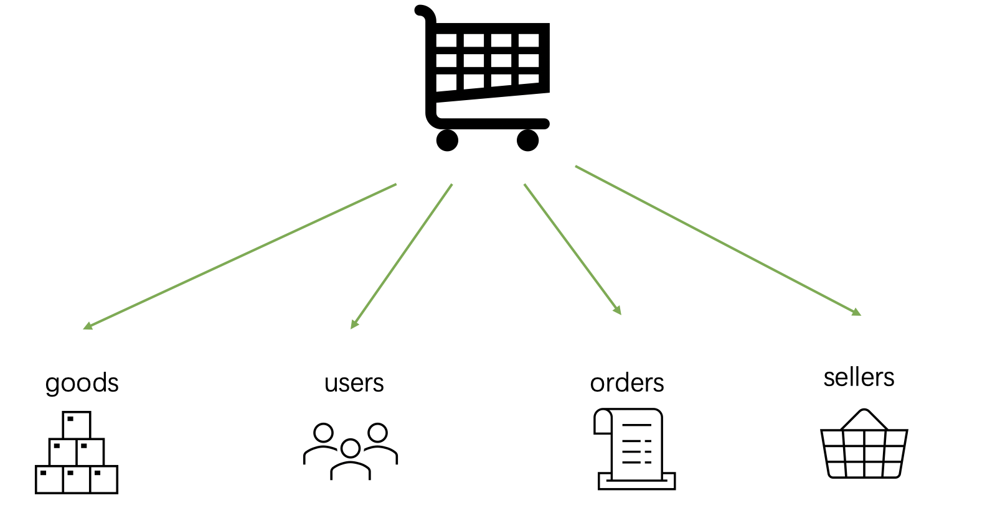
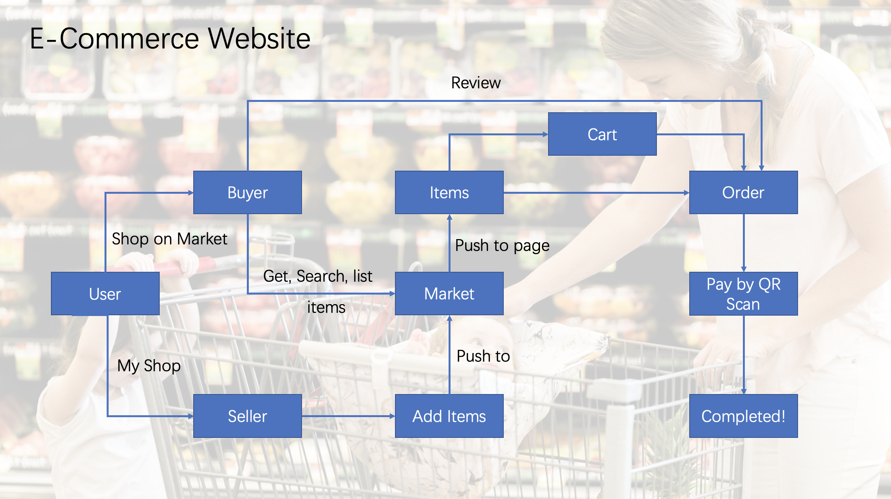

# team25__E-Commerce
Repository for team25

We developed this project in another private repo.
https://github.com/yuanpenc/E-commerce_webapp/tree/finalCode

## Responsibility

- Yuanpeng Cao: information app
- Peng Zeng: order app, seller app
- Yuhang Liang: goods app

## AWS deploy:

- http://3.94.143.22/

## Introduction

- E-Commerce is C2C e-commerce platform where users and sellers can make deals. 
- Like normal e-commerce buyers can search and buy goods and sellers can post their items on the platform. 
- Typical goods include books and electronic products. 
- Our E-Commerce consists of four parts. That is goods module, user’s information module, orders module and sellers module. 
  - 

## Work Flow

- 

